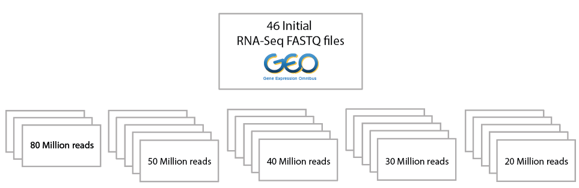

```{r initial, echo = FALSE, cache = FALSE, results = 'hide'}
library(knitr)
library(icon)
options(htmltools.dir.version = FALSE, tibble.width = 80, tibble.print_min = 6)
opts_chunk$set(
  echo = TRUE, warning = FALSE, message = FALSE, comment = "#>",
  fig.path = 'figure/', cache.path = 'cache/', fig.align = 'center', 
  fig.show = 'hold', 
  cache = TRUE, dev = 'svglite'
)
```


## Two most common types of workflows in `r emo::ji("man_technologist")`  Bioinformatics `r emo::ji("woman_technologist")`:

<br>

* **Interactive Sessions**: We need to run code and see interactively what’s happening (plots, model results etc...). For example, by using the terminal or `r icon::fa_r_project()` Studio.
 
* **Serial/Pipeline jobs** `r emo::ji("repeat")`: We need to perform the same series of steps (alignment,remove adapters, sort,mark duplicated, etc...) for tens of samples and we care only about the final result.

---

## Today's talk 

<br>
<br>

* A few comments about **Interactive Sessions**
 
* Why did I start using **Milton**? 
 
* How I use **Milton**


---


## Interactive Sessions with `r icon::fa_r_project()`

### From your local `r icon::fa_r_project()` Studio

`r emo::ji("+1")` I can update `r icon::fa_r_project()` `r emo::ji("package")` and version when I need to <br>
<br>
`r emo::ji("+1")` I can access files `r emo::ji("file_cabinet")` on the server and on my local `r emo::ji("computer")` 
<br>

```{r}
# Beginning of every script
# TRUE if running from local, FALSE if running from the server
local <- TRUE
mydir <- ifelse(local,"/Volumes/quaglieri.a/PHD_project/GEO_Leucegene_data",
                "/home/users/allstaff/quaglieri.a/PHD_project/GEO_Leucegene_data")

```

`r emo::ji("-1")` Slow `r emo::ji("turtle")` or even does not work with very large files

---

<br>
<br>

### `r icon::fa_r_project()` Studio on Unix or Milton


* http://unix401/auth-sign-in / http://unix309/auth-sign-in /  http://unix308/auth-sign-in
 
* I have never ran it using Milton but it is possible!
 
`r emo::ji("+1")` Faster `r emo::ji("zap")` than running from local `r icon::fa_r_project()` Studio! <br>
<br>
`r emo::ji("+1")` Cannot access directly files `r emo::ji("file_cabinet")` on my local `r emo::ji("computer")` <br>


---

<br>
<br>

### `ssh unix500`

* Best of both worlds `r emo::ji("clinking_glasses")`: hybrid between `torquelord` and the well known `unix` computers
 
* You can run analyses directly from it like a normal unix terminal, you can open screen sessions and you can also submit jobs on torquelord with `qsub`

* [Watch video](https://drive.google.com/file/d/1v3OmRfSk6NLZiIBB0ce74obP6aZsNxkm/view?usp=sharing)!


---

## Why did I start using Milton


* I had to run the same pipeline over and over again across many samples
* I got tired of opening tens of screen sessions on the unix machines to run jobs in "parallel"


---

### RNA-Seq pipeline: FASTQ files -> Annotated variants

Initial run for 46 RNA-Seq samples downloaded from GEO

1. FASTQC on raw Fastq files 
2. Alignment: `STAR` pass1 + `STAR` pass2
3. Mark Duplicates + add Read Groups with `Picard Tools`
5. Some QC: `ValidateSamFile`
4. Gene counts with `featureCounts`
5. Fusions with `STAR-Fusion`
6. GATK pre-processing (very slow!)
7. Call variants with four callers
8. Annotate variants with `VEP`


---

Pipeline to be run: 

```{r}
(46 * 3) + (4 * (46 * 5))
```

Times!




---

## How to use Milton: Example aligning reads with `Subread`

* We have to align 46 fastq files with `Subread::align()` in R
* Let's suppose we have created the `Subread` index since that needs to be created once for all!

```{r}
local <- TRUE
mydir <- ifelse(local,"/Volumes/quaglieri.a/PHD_project/GEO_Leucegene_data",
                "/home/users/allstaff/quaglieri.a/PHD_project/GEO_Leucegene_data")

library(Rsubread)

# Run Subread in the directory where the index is stored
setwd(file.path(mydir,"genomes/Subread_index"))
list.files()
```

---

### Run `Subread` on a terminal screen session

* Start terminal screen session

```{bash eval=FALSE}
ssh unix308
screen
module load R
R
```

* Run `Subread` from R

```{r eval=FALSE}
local <- FALSE
mydir <- ifelse(local,"/Volumes/quaglieri.a/PHD_project/GEO_Leucegene_data",
                "/home/users/allstaff/quaglieri.a/PHD_project/GEO_Leucegene_data")

library(Rsubread)

setwd(file.path(mydir,"genomes/Subread_index"))

# Get FASTQ files name
fastqdir <- "/wehisan/general/user_managed/grpu_majewski_3/quaglieri.a/GEO_Leucegene_data/sra_cbf_aml/fastq_20M_100"
reads1 <- list.files(path = fastqdir,pattern = "R1.fastq.gz$")
reads2 <- gsub("R1","R2",reads1)

# Align
align(index="hg19_index",readfile1=reads1,readfile2=reads2,phredOffset=64,nthreads = 10)
```

---

### `Subread` threading

* `Subread` will align the fastq files one after the other one (like a `for` loop)

* It applies multithreading when aligning the reads within every fastq file

* Milton will help you to:

  * **Align every fasq files at the same time**
  
  * Use `Subread` multithreading for every fastq file
  

---

## Align 46 bamfiles with `Subread` using Milton

### Step 1: Create the R scripts, one per sample

```{r}
local <- FALSE
mydir <- ifelse(local,"/Volumes/quaglieri.a/PHD_project/GEO_Leucegene_data",
                "/home/users/allstaff/quaglieri.a/PHD_project/GEO_Leucegene_data")

library(Rsubread)

setwd(file.path(mydir,"genomes/Subread_index"))

# Get FASTQ files name
fastqdir <- "/wehisan/general/user_managed/grpu_majewski_3/quaglieri.a/GEO_Leucegene_data/sra_cbf_aml/fastq_20M_100"
reads1 <- list.files(path = fastqdir,pattern = "R1.fastq.gz$",full.names = TRUE)
reads2 <- gsub("R1","R2",reads1)

dir.create("/wehisan/general/user_managed/grpu_majewski_3/Talks/MiltonUG/MiltonMyFriend/Scripts_Subread",recursive = TRUE,showWarnings = FALSE)
script_directory <- "/wehisan/general/user_managed/grpu_majewski_3/Talks/MiltonUG/MiltonMyFriend/Scripts_Subread"

# Create scripts, one for every Sample
for(read in 1:length(reads1)){
 
  read1 <- reads1[read] # get fastq file containing R1
  read2 <- reads2[read] # get fastq file containing R1
  sampleName <- basename(gsub("R1.fastq.gz","",read1)) # extract sampleName
  
  scriptSample <- file.path(script_directory,paste0(sampleName,"SubreadAlign.R")) # define script path for sampleName
  
  SubreadCall <- paste0("align(index='hg19_index',
                        readfile1=","'",read1,"'",
                        ",readfile2=","'",read2,"'",
                        ",nthreads = 10")
  
  cat('library(Rsubread) \n\n',file = scriptSample)
  
  cat("setwd('/home/users/allstaff/quaglieri.a/PHD_project/GEO_Leucegene_data/genomes/Subread_index') \n\n",file = scriptSample,append = TRUE)
  
  cat(SubreadCall,file = scriptSample,append = TRUE)
   
}

```


---

### How `SRX959064_SubreadAlign.R` looks like

```{r eval=FALSE}
library(Rsubread)

setwd('/home/users/allstaff/quaglieri.a/PHD_project/GEO_Leucegene_data/genomes/Subread_index')

align(index='hg19_index',
                        readfile1='/wehisan/general/user_managed/grpu_majewski_3/quaglieri.a/GEO_Leucegene_data/sra_cbf_aml/fastq_20M_100/SRX959064_R1.fastq
.gz',readfile2='/wehisan/general/user_managed/grpu_majewski_3/quaglieri.a/GEO_Leucegene_data/sra_cbf_aml/fastq_20M_100/SRX959064_R2.fastq.gz',nthreads = 10
```


---

### Step 2: Create the bash `.sh` scripts, one per sample

#### Directly from `unix500`

* `#!/bin/bash` starts every `bash` script
* `#PBS -l nodes=1:ppn=10,mem=32gb` to request:
  * `nodes` = computer. Generally always 1. 
  * `ppn` = `nthreads` in `Rsubread::align()`
  * `mem` memory needed, not always clear how much is needed! But there are some trickes for it.

```{bash eval=FALSE}
# variable assignment in bash
scriptdir=/wehisan/general/user_managed/grpu_majewski_3/Talks/MiltonUG/MiltonMyFriend/Scripts_Subread

for align_script in ${scriptdir}/*SubreadAlign.R ; do 

  sampleName_tmp=$(basename ${align_script}) # same as basename() in R
  sampleName=${sampleName_tmp/_SubreadAlign.R/} # same as gsub() in R
  
  echo '#!/bin/bash' > ${scriptdir}/${sampleName}_SubreadAlign.sh # echo same as cat() in R
  echo '#PBS -l nodes=1:ppn=10,mem=32gb' >> ${scriptdir}/${sampleName}_SubreadAlign.sh # >> same as cat(append=TRUE)
  echo "#PBS -N ${sampleName}" >> ${scriptdir}/${sampleName}_SubreadAlign.sh # Job Name
  echo "#PBS -o ${sampleName}_out" >> ${scriptdir}/${sampleName}_SubreadAlign.sh # std_out name
  echo "#PBS -e ${sampleName}_err" >> ${scriptdir}/${sampleName}_SubreadAlign.sh # std_err name
  echo '' >> ${scriptdir}/${sampleName}_SubreadAlign.sh

  echo $align_script >> ${scriptdir}/${sampleName}_SubreadAlign.sh

done

```


---

### How `SRX959064_SubreadAlign.sh` looks like

```{bash eval=FALSE}
#!/bin/bash
#PBS -l nodes=1:ppn=10,mem=32gb
#PBS -N SRX959064
#PBS -o SRX959064_out
#PBS -e SRX959064_err

/wehisan/general/user_managed/grpu_majewski_3/Talks/MiltonUG/MiltonMyFriend/Scripts_Subread/SRX959064_SubreadAlign.R
```


--- 

### Submit the job/s


```{r}

```

