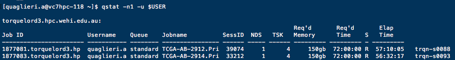

```{r initial, echo = FALSE, cache = FALSE, results = 'hide'}
library(knitr)
library(icon)
options(htmltools.dir.version = FALSE, tibble.width = 80, tibble.print_min = 6)
opts_chunk$set(
  echo = TRUE, warning = FALSE, message = FALSE, comment = "#>",
  fig.path = 'figure/', cache.path = 'cache/', fig.align = 'center', 
  fig.show = 'hold', 
  cache = TRUE, dev = 'svglite'
)
```


## Two most common types of workflows in `r emo::ji("man_technologist")`  Bioinformatics `r emo::ji("woman_technologist")`:

<br>

* **Interactive Sessions**: We need to run code and see interactively what’s happening (plots, model results etc...). For example, by using the terminal or `r icon::fa_r_project()` Studio.
 
* **Serial/Pipeline jobs** `r emo::ji("repeat")`: We need to perform the same series of steps (alignment,remove adapters, sort,mark duplicated, etc...) for tens of samples and we care only about the final result.

---

## Today's talk 

<br>
<br>

* A few comments about **Interactive Sessions**
 
* Why did I start using **Milton**? 
 
* How I use **Milton**


---


## Interactive Sessions with `r icon::fa_r_project()`

### From your local `r icon::fa_r_project()` Studio

`r emo::ji("+1")` I can update `r icon::fa_r_project()` `r emo::ji("package")` and version when I need to <br>
<br>
`r emo::ji("+1")` I can access files `r emo::ji("file_cabinet")` on the server and on my local `r emo::ji("computer")` 
<br>

```{r}
# Beginning of every script
# TRUE if running from local, FALSE if running from the server
local <- TRUE
mydir <- ifelse(local,"/Volumes/quaglieri.a/PHD_project",
                "/home/users/allstaff/quaglieri.a/PHD_project")

```

`r emo::ji("-1")` Slow `r emo::ji("turtle")` or even does not work with very large files

---

<br>
<br>

### `r icon::fa_r_project()` Studio on Unix or Milton


* http://unix401/auth-sign-in / http://unix309/auth-sign-in /  http://unix308/auth-sign-in
 
* I have never ran it using Milton but it is possible!
 
`r emo::ji("+1")` Faster `r emo::ji("zap")` than running from local `r icon::fa_r_project()` Studio! <br>
<br>
`r emo::ji("+1")` Cannot access directly files `r emo::ji("file_cabinet")` on my local `r emo::ji("computer")` <br>


---

<br>
<br>

### `ssh unix500`

* Best of both worlds `r emo::ji("clinking_glasses")`: hybrid between `torquelord` and the well known `unix` computers
 
* You can run analyses directly from it like a normal unix terminal, you can open screen sessions and you can also submit jobs on torquelord with `qsub`

---

## Message from `r icon::fa_r_project()` users to IT

<br>
<br>

* It would be great that when `r icon::fa_r_project()` is updated on the servers, it is also updated on `r icon::fa_r_project()` Studio on the servers. 

* The latest `r icon::fa_r_project()` version should be the default everywhere and if someone needs a previous version will go through the terminal

---

## Why did I start using Milton

<br>
<br>
<br>

* I had to run the same pipeline over and over again across many samples
* I got tired of opening tens of screen sessions on the unix machines to run jobs in "parallel"

😐-

### RNA-Seq pipeline: FASTQ files -> Annotated variants

Initial run for 46 RNA-Seq samples downloaded from GEO

1. FASTQC on raw Fastq files 
2. Alignment: `STAR` pass1 + `STAR` pass2
3. Mark Duplicates + add Read Groups with `Picard Tools`
5. Some QC: `ValidateSamFile`
4. Gene counts with `featureCounts`
5. Fusions with `STAR-Fusion`
6. GATK pre-processing (very slow!)
7. Call variants with four callers
8. Annotate variants with `VEP`


---

Pipeline to be run: 

```{r}
(46 * 3) + (4 * (46 * 5))
```

Times!


---

## How I use Milton

<br>
<br>

1. Final structure of `job.sh` to submit with `qsub`

2. How to create an R script for a job (many different ways really!)

3. How to submit the R script to the queue system

4. How to monitor how your job is doing and where it is at

5. Check statistics after job is run to improve your submission

---

## Final structure of job to submit

Really, you can create it in the way you prefer but the final structure should look like the one below!


---

<br>
<br>

```{bash eval=FALSE}
ssh unix500

qsub ScriptToSubmit.sh
```



* `NDS` = `nodes=1`

* `TSK` = `ppn=4`

* `Req'd memory` = `mem=4gb`

* `Req'd time` = `walltime=hh:mm:ss` see [here](http://catalyst.wehi.edu.au/research/computationalbiology/Pages/walltimes.aspx) fore info about walltime 

Find more information on the Milton page on [Catalyst](http://catalyst.wehi.edu.au/research/computationalbiology/Pages/Quick-Start-Guide-to-using-the-HPC.aspx)


---

<br>
<br>
<br>

Check example script `AlignWithSubread.Rmd` on  

`r icon::fa_github()` https://github.com/annaquaglieri16/MiltonMyFriend

```{bash eval=FALSE}
git clone https://github.com/annaquaglieri16/MiltonMyFriend
```

---

## Summary of key commands that you want to keep in mind

* **Submit a job**: `qsub` (see slide above for `#PBS` specifications)

* **Check running jobs**: `qstat -n1 -u $USER`

* `ssh trqn-###` : ssh into a computer (node) where you can use `top` to monitor your job

* `cd /stornext/HPCScratch/.torque/spool/` to check `stdout` and `stderr` of running jobs. Use `Jobid` to find a specific job

* **Delete a job already submitted**: `qdel jobid`  (JOBID.torquelord3.hps0080)

* `module load its-tools` and `torquestats -u $USER -p` to monitor usage of past jobs


