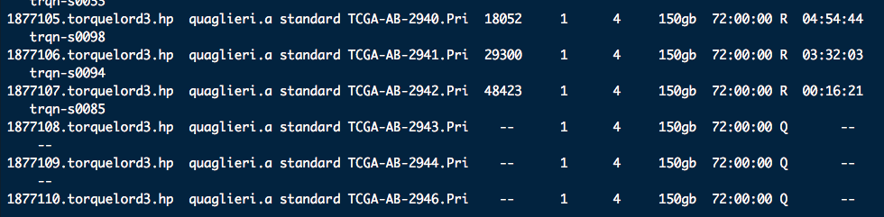
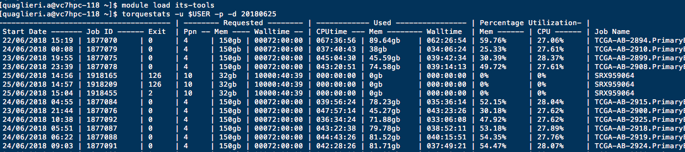

Align fastq files with Subread on Milton
================
Anna Quaglieri
25/06/2018

-   [Create R scripts to run RSubread on Milton](#create-r-scripts-to-run-rsubread-on-milton)
    -   [One usual way: Run `Subread` on a terminal screen session](#one-usual-way-run-subread-on-a-terminal-screen-session)
        -   [`Subread` threading](#subread-threading)
    -   [The Milton way](#the-milton-way)
        -   [Create the R scripts, one per sample](#create-the-r-scripts-one-per-sample)
        -   [Create the bash `.sh` scripts, one per sample](#create-the-bash-.sh-scripts-one-per-sample)
        -   [How an example `.sh` script looks like](#how-an-example-.sh-script-looks-like)
-   [Submit the job/s to the queue: `qsub`](#submit-the-jobs-to-the-queue-qsub)
-   [Monitor your jobs while their running: `qstat`](#monitor-your-jobs-while-their-running-qstat)
    -   [Access `std_err` and `std_out` of running jobs](#access-std_err-and-std_out-of-running-jobs)
    -   [General way to find the folder where the `ER` and `OUT` go](#general-way-to-find-the-folder-where-the-er-and-out-go)
-   [4. Check your job statistics after they had ran: `torquestats`](#check-your-job-statistics-after-they-had-ran-torquestats)

``` bash

cd /home/users/allstaff/quaglieri.a/PHD_project/

git clone git@github.com:annaquaglieri16/MiltonMyFriend.git
```

Create R scripts to run RSubread on Milton
==========================================

-   Subread needs to be run in the directory where the genome index was created

``` r
library(Rsubread)

# Run Subread in the directory where the index is stored
setwd(file.path(here(),"Subread_Example/Subread_index"))
list.files()
```

    ## character(0)

One usual way: Run `Subread` on a terminal screen session
---------------------------------------------------------

-   Start terminal screen session

``` bash
ssh unix308

screen

module load R

R
```

-   `file.path(here(),"Subread_Example/Subread_index")` will give `/Volumes/quaglieri.a/PHD_project/MiltonMyFriend/Subread_Example/Subread_index` but since I need to access the files from the unix computer I need to substitute `Volumes` with `/home/users/allstaff/`

``` r
library(Rsubread)

setwd(file.path("/home/users/allstaff/quaglieri.a/PHD_project","MiltonMyFriend/Subread_Example/Subread_index"))
# Get FASTQ files name
fastqdir <- file.path("/home/users/allstaff/quaglieri.a/PHD_project","MiltonMyFriend/Subread_Example/example_bamfiles")
reads1 <- list.files(path = fastqdir,pattern = "R1.fastq.gz$",full.names = TRUE)
reads2 <- gsub("R1","R2",reads1)

# Align
align(index="hg19_index",readfile1=reads1,readfile2=reads2,nthreads = 10)
```

### `Subread` threading

-   `Subread` will align the fastq files one after the other one (like a `for` loop)

-   It applies multithreading when aligning the reads within every fastq file

-   Milton will help you to:

-   **Align every fastq file at the same time**

-   Use `Subread` multithreading for every fastq file

The Milton way
--------------

### Create the R scripts, one per sample

``` r
repo_dir <- "/home/users/allstaff/quaglieri.a/PHD_project"

library(Rsubread)

setwd(file.path(repo_dir,"MiltonMyFriend/Subread_Example/Subread_index"))

# Get FASTQ files name
fastqdir <- file.path(repo_dir,"MiltonMyFriend/Subread_Example/example_bamfiles")
reads1 <- list.files(path = fastqdir,pattern = "R1.fastq.gz$",full.names = TRUE)
reads2 <- gsub("R1","R2",reads1)

# Directory where to save the R scripts
dir.create(file.path(repo_dir,"MiltonMyFriend/Subread_Example/Scripts_Subread"),recursive = TRUE,showWarnings = FALSE)
script_directory <- file.path(repo_dir,"MiltonMyFriend/Subread_Example/Scripts_Subread")

# Create scripts, one for every Sample
for(read in 1:length(reads1)){
 
  read1 <- reads1[read] # get fastq file containing R1
  read2 <- reads2[read] # get fastq file containing R1
  sampleName <- basename(gsub("_R1.fastq.gz","",read1)) # extract sampleName
  
  scriptSample <- file.path(script_directory,paste0(sampleName,"_SubreadAlign.R")) # define script path for sampleName
  
  SubreadCall <- paste0("align(index='hg19_index',
                        readfile1=","'",read1,"'",
                        ",readfile2=","'",read2,"'",
                        ",nthreads = 10,",
                        "output_file=","'",file.path(dirname(scriptSample),paste0(sampleName,".bam")),"')")
  
  cat('library(Rsubread) \n\n',file = scriptSample)
  
  cat("setwd('/home/users/allstaff/quaglieri.a/PHD_project/MiltonMyFriend/Subread_Example/Subread_index') \n\n",file = scriptSample,append = TRUE)
  
  cat(SubreadCall,file = scriptSample,append = TRUE)
   
}
```

**How `SRX381851_SubreadAlign.R` looks like**

Other scripts will have the exact same structure but with a different file name.

``` r
library(Rsubread)

setwd("/home/users/allstaff/quaglieri.a/PHD_project/MiltonMyFriend/Subread_Example/Subread_index")

align(index = "hg19_index", readfile1 = "/home/users/allstaff/quaglieri.a/PHD_project/MiltonMyFriend/Subread_Example/example_bamfiles/SRX381851_R1.fastq.gz", 
    readfile2 = "/home/users/allstaff/quaglieri.a/PHD_project/MiltonMyFriend/Subread_Example/example_bamfiles/SRX381851_R2.fastq.gz", 
    nthreads = 10, output_file = "/home/users/allstaff/quaglieri.a/PHD_project/MiltonMyFriend/Subread_Example/Scripts_Subread/SRX381851.bam")
```

### Create the bash `.sh` scripts, one per sample

Every `.R` scrips needs to be wrapped inside a bash `.sh` script to be queued.

``` bash
# variable assignment in bash
scriptdir=/home/users/allstaff/quaglieri.a/PHD_project/MiltonMyFriend/Subread_Example/Scripts_Subread

for align_script in ${scriptdir}/*SubreadAlign.R ; do 

  sampleName_tmp=$(basename ${align_script}) # same as basename() in R
  sampleName=${sampleName_tmp/_SubreadAlign.R/} # same as gsub() in R
  
  echo '#!/bin/bash' > ${scriptdir}/${sampleName}_SubreadAlign.sh # echo same as cat() in R
  echo '#PBS -l nodes=1:ppn=10,mem=32gb' >> ${scriptdir}/${sampleName}_SubreadAlign.sh # >> same as cat(append=TRUE)
  echo '#PBS -l walltime=04:00:00' >> ${scriptdir}/${sampleName}_SubreadAlign.sh 
  echo "#PBS -N ${sampleName}" >> ${scriptdir}/${sampleName}_SubreadAlign.sh # Job Name
  echo "#PBS -o ${scriptdir}/${sampleName}_out" >> ${scriptdir}/${sampleName}_SubreadAlign.sh # std_out name
  echo "#PBS -e ${scriptdir}/${sampleName}_err" >> ${scriptdir}/${sampleName}_SubreadAlign.sh # std_err name
  echo '' >> ${scriptdir}/${sampleName}_SubreadAlign.sh

  echo $align_script >> ${scriptdir}/${sampleName}_SubreadAlign.sh

done
```

### How an example `.sh` script looks like

``` bash
#!/bin/bash
#PBS -l nodes=1:ppn=10,mem=32gb
#PBS -l walltime=04:00:00
#PBS -N SRX381851
#PBS -o /home/users/allstaff/quaglieri.a/PHD_project/MiltonMyFriend/Subread_Example/Scripts_Subread/SRX381851_out
#PBS -e /home/users/allstaff/quaglieri.a/PHD_project/MiltonMyFriend/Subread_Example/Scripts_Subread/SRX381851_err

/home/users/allstaff/quaglieri.a/PHD_project/MiltonMyFriend/Subread_Example/Scripts_Subread/SRX381851_SubreadAlign.R
```

Submit the job/s to the queue: `qsub`
=====================================

``` bash
ssh unix500

cd /home/users/allstaff/quaglieri.a/PHD_project/MiltonMyFriend/Subread_Example/Scripts_Subread

chmod 775 *
qsub SRX729580_SubreadAlign.sh
```

Monitor your jobs while their running: `qstat`
==============================================

-   `qstat`

``` bash
qstat -u $USER
```

-   Setup **aliases** into `.bashrc`

``` bash
alias q="qstat -u $USER"
```

Access `std_err` and `std_out` of running jobs
----------------------------------------------

`stdout` and `stderr` will be in `/stornext/HPCScratch/.torque/spool/`.

``` bash
ssh unix500

cd /stornext/HPCScratch/.torque/spool/
```

1.  Extract the `Job ID` of the running jobs

``` bash
ssh unix500

qstat -n1 -u $USER
```



1.  Go into folder and look for your Job ID: `JobID.torquelord3.hp`

``` bash
cd /stornext/HPCScratch/.torque/spool/

#find . -name "JobID*"

find . -name "1877081*"
```

`[quaglieri.a@trqn-s0085 spool]$ find . -name "1877081*" ./1877081.torquelord3.hpc.wehi.edu.au.OU ./1877081.torquelord3.hpc.wehi.edu.au.ER`

General way to find the folder where the `ER` and `OUT` go
----------------------------------------------------------

1.  Login into a node (name starting with `trqn-`)

``` bash
qstat -n1 -u $USER
ssh trqn-s0085
```

1.  Find Process ID: `PID`

``` bash
ps ux
```

Example:

`quaglie+ 45330  0.0  0.0   9504  1404 ?        S    Jun24   0:00 /bin/bash /var/spool/torque/mom_priv/jobs/1877084.torquelord3.hpc.wehi.edu.au.SC`

1.  List files inside the process folder

``` bash
ls -l /proc/45330/fd
```

4. Check your job statistics after they had ran: `torquestats`
==============================================================

``` bash
ssh unix500

module load its-tools
torquestats -u $USER -p | less
 
torquestats --h

torquestats -u $USER -d 20180625 -p 
```


